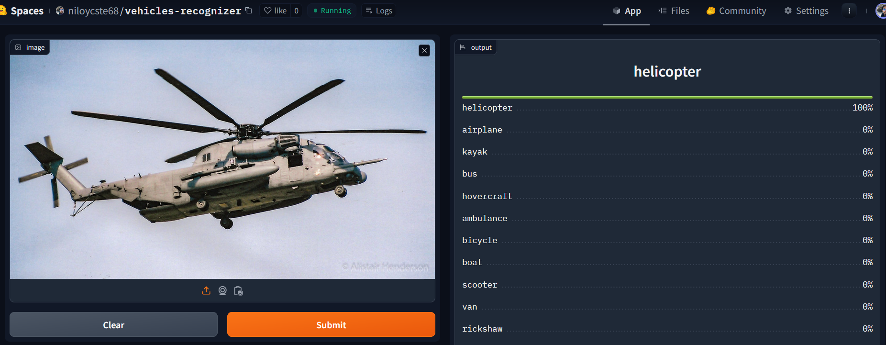
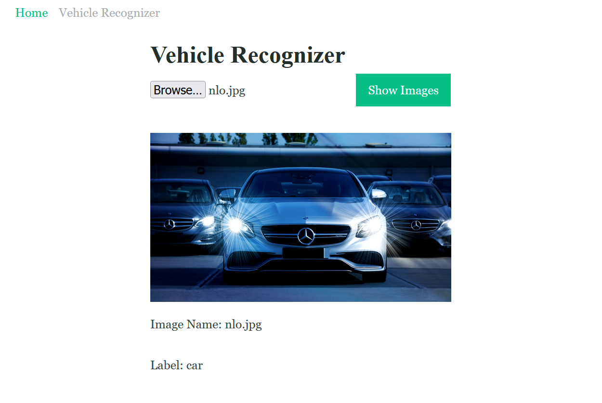

# Vehicles-recognizer

Welcome to the Vehicle Image Recognizer, a powerful system capable of classifying various vehicles. Below is a list of vehicles it can identify: 

- Car
- Motorcycle
- Bicycle
- Truck
- Bus
- Van
- Rickshaw
- Scooter
- Skateboard
- Ambulance
- Fire Truck
- Tractor
- Segway
- Unicycle
- Jet Ski
- Helicopter
- Airplane
- Boat
- Kayak
- Hovercraft

# Objective of build up Vehicle Recognizer
The Vehicle Image Recognizer is a high-tech tool that automatically identifies and categorizes different types of vehicles in pictures. Using smart computer vision tricks, it's really good at figuring out all kinds of vehicles, like cars, motorcycles, helicopters, boats etc. It's like magic for telling what's in a picture of traffic or anywhere with vehicles. This smart tool helps out in lots of ways, making it easier to manage traffic, keep an eye on things with surveillance, and generally make sure everything is running smoothly. It's like having a super-smart friend that knows a lot about vehicles.  

# Dataset Preparation
**Data Collection:** Downloaded from DuckDuckGo using term name  
**DataLoader:** Used fastai DataBlock API to set up the DataLoader. 
**Data Augmentation:** fastai provides default data augmentation which operates in GPU. 
Details can be found in `notebooks/Data_Prep.ipynb`

# Training and Data Cleaning

**Training:** Fine-tuned a resnet34 model for 5 epochs (3 times) and got upto ~96% accuracy. 
**Data Cleaning:** This part took the highest time. Since I collected data from browser, there were many noises. Also, there were images that contained. I cleaned and updated data using fastai ImageClassifierCleaner. I cleaned the data each time after training or finetuning, except for the last time which was the final iteration of the model.  

# Model Deployment
I deployed to model to HuggingFace Spaces Gradio App. The implementation can be found in `deployment`folder or [here](https://huggingface.co/spaces/niloycste68/Vehicles-recognizer)  

# API integration with GitHub Pages
The deployed model API is integrated [here](https://niloycste.github.io/Vehicles-Image-Recognizer/) in GitHub Pages Website. Implementation and other details can be found in `docs` folder.

